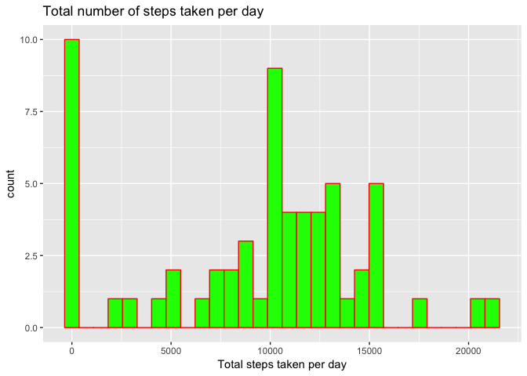
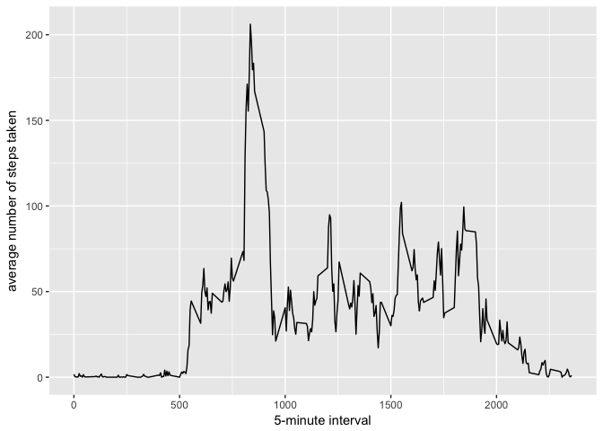
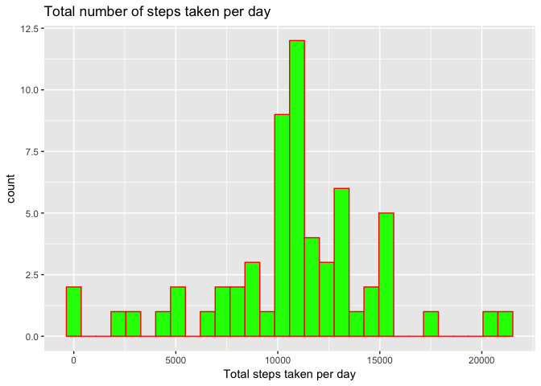
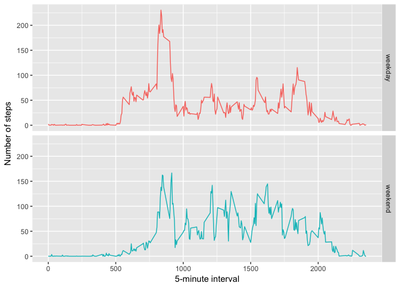

Instructions and Context
------------------------

It is now possible to collect a large amount of data about personal
movement using activity monitoring devices such as a Fitbit, Nike
Fuelband, or Jawbone Up. These type of devices are part of the
“quantified self” movement – a group of enthusiasts who take
measurements about themselves regularly to improve their health, to find
patterns in their behavior, or because they are tech geeks. But these
data remain under-utilized both because the raw data are hard to obtain
and there is a lack of statistical methods and software for processing
and interpreting the data.

This assignment makes use of data from a personal activity monitoring
device. This device collects data at 5 minute intervals through out the
day. The data consists of two months of data from an anonymous
individual collected during the months of October and November, 2012 and
include the number of steps taken in 5 minute intervals each day.

The data for this assignment can be downloaded from the course web site:

The variables included in this dataset are:

-   steps: Number of steps taking in a 5-minute interval (missing values
    are coded as NA NA)
-   date: The date on which the measurement was taken in YYYY-MM-DD
    format
-   interval: Identifier for the 5-minute interval in which measurement
    was taken

Loading the Data and performong some preprocessing
--------------------------------------------------

    unzip(zipfile="activity.zip")  
    data <- read.csv("activity.csv")
    data$date <- as.POSIXct(data$date, "%Y-%m-%d")
    weekday <- weekdays(data$date)
    data <- cbind(data,weekday)

    str(data)

    ## 'data.frame':    17568 obs. of  4 variables:
    ##  $ steps   : int  NA NA NA NA NA NA NA NA NA NA ...
    ##  $ date    : POSIXct, format: "2012-10-01" "2012-10-01" ...
    ##  $ interval: int  0 5 10 15 20 25 30 35 40 45 ...
    ##  $ weekday : Factor w/ 7 levels "Friday","Monday",..: 2 2 2 2 2 2 2 2 2 2 ...

    summary(data)

    ##      steps             date               interval           weekday    
    ##  Min.   :  0.00   Min.   :2012-10-01   Min.   :   0.0   Friday   :2592  
    ##  1st Qu.:  0.00   1st Qu.:2012-10-16   1st Qu.: 588.8   Monday   :2592  
    ##  Median :  0.00   Median :2012-10-31   Median :1177.5   Saturday :2304  
    ##  Mean   : 37.38   Mean   :2012-10-31   Mean   :1177.5   Sunday   :2304  
    ##  3rd Qu.: 12.00   3rd Qu.:2012-11-15   3rd Qu.:1766.2   Thursday :2592  
    ##  Max.   :806.00   Max.   :2012-11-30   Max.   :2355.0   Tuesday  :2592  
    ##  NA's   :2304                                           Wednesday:2592

What is mean total number of steps taken per day?
-------------------------------------------------

    if(require(ggplot2)==FALSE)(install.packages("ggplot2")); library(ggplot2)
    if(require(dplyr)==FALSE)(install.packages("dplyr")); library(dplyr)
    data2<-data%>%
            group_by(date)%>%
            summarise(activity_step=sum(steps,na.rm=TRUE))
    ggplot(data=data2, aes(data2$activity_step)) + 
      geom_histogram( 
                     col="red", 
                     fill="green"
                     ) + 
      labs(title="Total number of steps taken per day")+
      xlab("Total steps taken per day")

    mean(data2$activity_step,na.rm=TRUE)

    ## [1] 9354.23

    median(data2$activity_step, na.rm=TRUE)

    ## [1] 10395

What is the average daily activity pattern?
-------------------------------------------

    data3<-data%>%
      group_by(interval)%>%
      summarise(steps=mean(steps,na.rm=TRUE))

    ggplot(data=data3, aes(x=interval, y=steps)) +
      geom_line() +
      xlab("5-minute interval") +
      ylab("average number of steps taken")

On average across all the days in the dataset, the 5-minute interval
contains the maximum number of steps?

    data3[which.max(data3$steps), ]$interval

    ## [1] 835

Imputing missing values
-----------------------

There are many days/intervals where there are missing values (coded as
`NA`). The presence of missing days may introduce bias into some
calculations or summaries of the data.

    ## missing
    sum(is.na(data$steps))

    ## [1] 2304

All of the missing values should be imputed with mean value for that
5-minute interval.

    # Creating a function to imput missing values with mean for that 5 minute interval
    valueImputation <- function(steps, interval) {
      filled <- NA
      if (!is.na(steps))
        filled <- c(steps)
      else
        filled <- (data3[data3$interval==interval, "steps"])
      return(filled)
    }
    imputedData<- data
    imputedData$steps <- mapply(valueImputation, imputedData$steps, imputedData$interval)

Now, using the filled data set, let's make a histogram of the total
number of steps taken each day and calculate the mean and median total
number of steps.

    data5<-imputedData%>%
      group_by(date)%>%
      summarise(activity_step=sum(as.numeric(steps),na.rm=TRUE))

    ggplot(data=data5, aes(data5$activity_step)) + 
      geom_histogram( 
        col="red", 
        fill="green") + 
      labs(title="Total number of steps taken per day")+
      xlab("Total steps taken per day")

    ## `stat_bin()` using `bins = 30`. Pick better value with `binwidth`.

 Here
are the mean and the median

    mean(data5$activity_step,na.rm=TRUE)

    ## [1] 10766.19

    median(data5$activity_step, na.rm=TRUE)

    ## [1] 10766.19

Mean and median values are higher after imputing missing data. The
reason is that in the original data, there are some days with `steps`
values `NA` for any `interval`. The total number of steps taken in such
days are set to 0s by default. However, after replacing missing `steps`
values with the mean `steps` of associated `interval` value, these 0
values are removed from the histogram of total number of steps taken
each day.

Are there differences in activity patterns between weekdays and weekends?
-------------------------------------------------------------------------

Create a new factor variable in the dataset with two levels -- "weekday"
and "weekend" indicating whether a given date is a weekday or weekend
day.

    dayOrWeeekend <- function(date) {
      day <- weekdays(date)
      if (day %in% c("Monday", "Tuesday", "Wednesday", "Thursday", "Friday"))
        return("weekday")
      else if (day %in% c("Saturday", "Sunday"))
        return("weekend")
      else
        stop("invalid date")
    }
    imputedData$date <- as.Date(imputedData$date)
    imputedData$day <- sapply(imputedData$date, FUN=dayOrWeeekend)

Make a panel plot containing a time series plot (i.e. type = “l”) of the
5-minute interval (x-axis) and the average number of steps taken,
averaged across all weekday days or weekend days (y-axis). See the
README file in the GitHub repository to see an example of what this plot
should look like using simulated data.

    data6<-imputedData%>%
      group_by(interval,day)%>%
      summarise(steps=mean(as.numeric(steps),na.rm=TRUE))

    ggplot(data6, aes(interval, steps,color=day)) +
    geom_line() +
    facet_grid(day ~ .)+ 
    xlab("5-minute interval") +
      ylab("Number of steps")+
      theme(legend.position="none")

